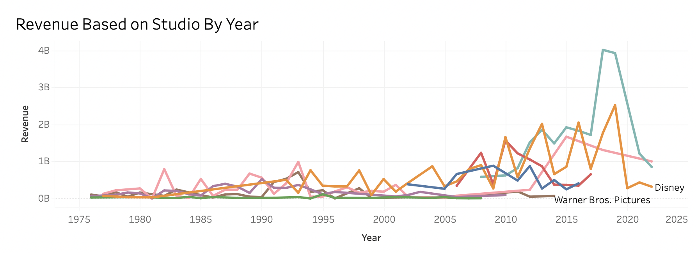
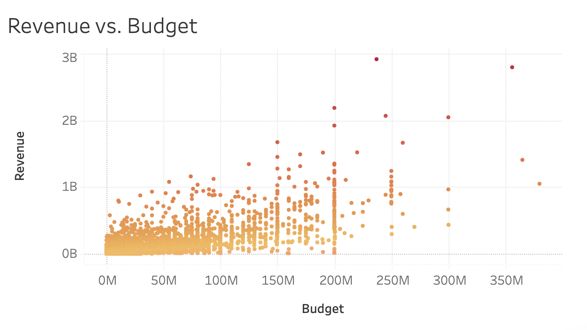
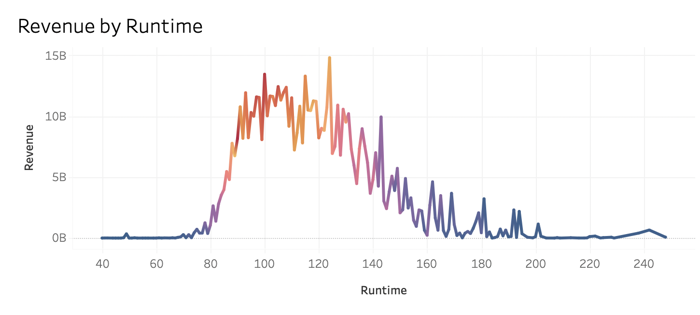
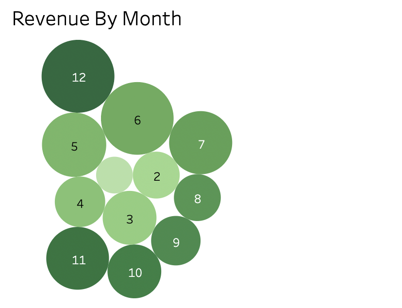
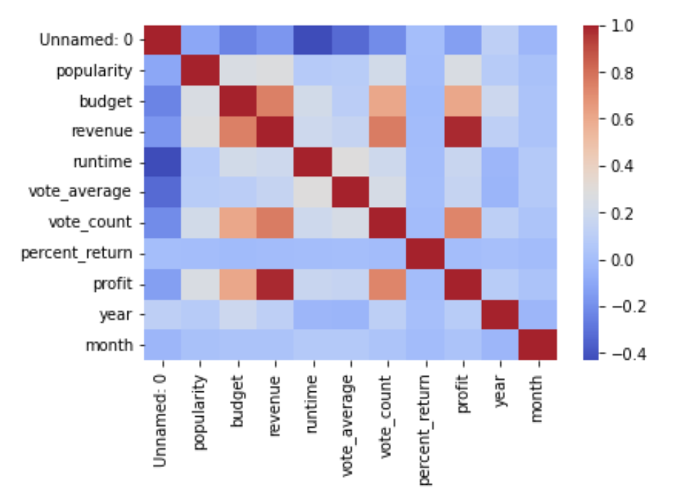
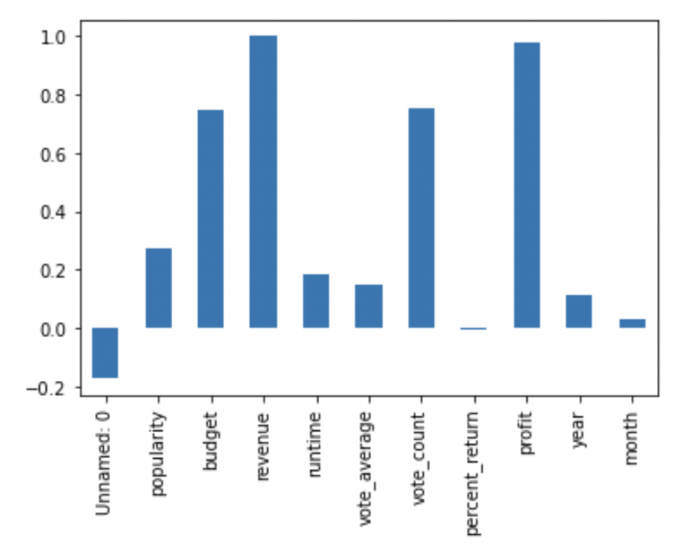
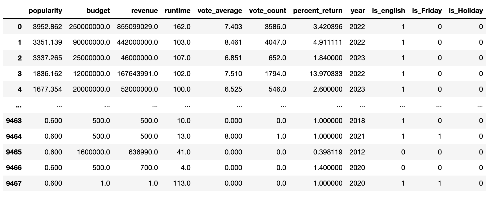
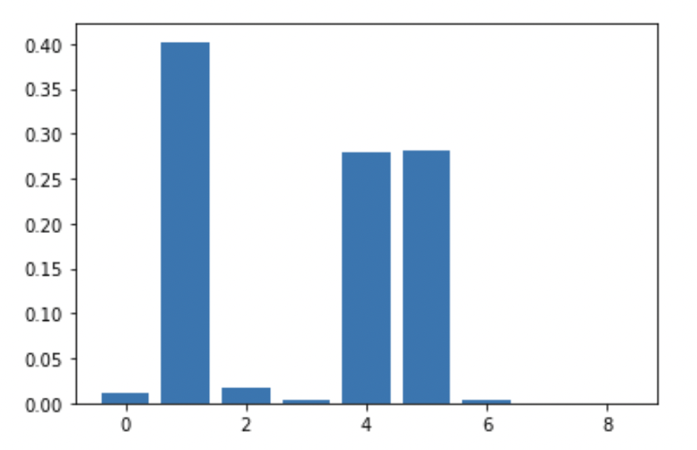
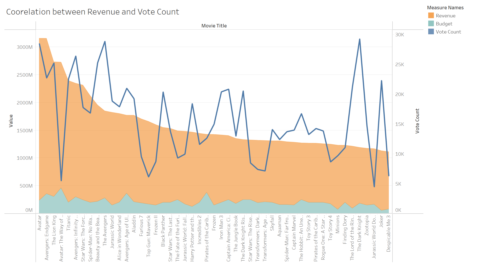

# Movie Mania

PowerPoint Slides: https://docs.google.com/presentation/d/162YHbYjVe89yhtYzliMm_hSdDQcU9TnsbySZIvNLgTI/edit

Tableau Visualizations: https://public.tableau.com/app/profile/ramya.nivedha/viz/Group4Project4PredictingMovieSuccess/Visualizations?publish=yes

Kaggle Dataset: https://www.kaggle.com/code/rounakbanik/the-story-of-film/notebook

# Objective
Our group sought to predict the profitability of a movie, based on numerous features. To do so we sought to take two approaches, making predictions based off of a machine learning model and using Tableau to visualize the data to track correlations between profit and specific features. 

# Data Cleaning
We used "The Movie Dataset" from Kaggle.com which included multiple csv files detailing movie information spanning 1924-2022. There were many useful features in this dataset; however, we filtered down the dataset to use only what we determined to be useful in our machine learning model as well as Tableau visualizations. The necessary features being: 
- 'title': movie title
- 'genres': genres that best describe the film (split into two categories - genre 1 and genre 2)
- 'original_language': language of movie
- 'overview': description of movie
- 'popularity': popularity score based off of website data was pulled from
- 'production_companies': studio/production company that produced the movie
- 'release_date': release date of the movie
- 'budget': amount of money that was estimated to produce movie 
- 'revenue':amount of money movie made in box office
- 'runtime': length of movie in minutes
- 'vote_average': vote score  based off of website data was pulled from
- 'vote_count': vote count based off of website data was pulled from
- 'poster_path': visualization of movie poster

We cleaned and enhanced the data set in data_cleanup.ipynb in the following ways: 
- read in movie.csv which can be found in the above Kaggle Dataset link
- added two columns: 
  - 'percent_return': revenue / budget
  - 'profit': revenue - budget
- dropped all null values
- grouped together the top production companies and labeled other smaller companies as 'other'
- split the 'genres' category into 'genre 1' and 'genre 2', each with string values, for simplicity
- split the 'release_date' column into 'year','month', and 'day'
- checked for and dropped all duplicate values
- saved new dataset as __cleaned_movie.csv__

The total dataset, after cleaning took place, contained 9468 data points, which was used to produce the Tableau visualizations. 

# Visualizations

We used the cleaned data set to build some visualizations to see what kind of predictions we could make based on the data prior to running any machine learning models. We analyzed trends in revenue when compared with the production studios and genres included in the data set. Through visualizing in Tableau, we found that any movie with a longer than average runtime is less profitable than those with average runtimes. We also analyzed how revenue is impacted by a specific time of the year and found that movies released in holiday months will have higher revenue than movies released in other months. Here are the visualizations that were considered in this discussion: 

- The budget of a movie does not have a high correlation with it's revenue.

- Films with significantly longer run times are not as profitable as those with runtimes at approximately 2 hours. 

- The most profitable months are December and June.

# Machine Learning

## Feature Engineering

- We created a correlatation matrix to analyze the correlation between the features and the target variable, revenue. The features with higher correlation include profit, vote_count and budget. 

- Then, we engineered the non numerical variables so that they became boolean values.
    - the 'original_language' column was changed to is/is not english
    - the 'days' column was changed to is/is not friday
    - the 'months' column was changed to is/is not holiday

- The machine learning dataset contained the following features (all either int or boolean): 
    - 'popularity'
    - 'budget'
    - 'revenue'
    - 'vote_average'
    - 'vote_count'
    - 'percent_return'
    - 'year'
    - 'is_english'
    - 'is_Friday'
    - 'is_Holiday'

- The new dataset was saved as __machine_learning_df.csv__

## Linear Regression

- First, the X (features) and y (target) sets were defined
- Then, the dataset was split into training and testing values using a random state of 1
- Next, the data was scaled using a StandardScaler
- We fit the model using the scaled training data 
- A function was created to find Mean Absolute Percentage Error
- Then we printed the training and testing scores to determine the model's accuracy and mean absolute error. 
- The Linear Regression Model had an training accuracy score of __0.7149__ and a testing accuracy score of __0.6955__
- The model had a training Mean Absolute Percentage Error of __0.06%__ and a testing Mean Absolute Percentage Error of __6.98%__

## Lasso Regression

- Lasso regression was utilized to select features that are most important to the model
- First, the X (features) and y (target) sets were defined
- Then, the dataset was split into training and testing values using a random state of 1
- Next, the data was scaled using a StandardScaler
- We fit the model using the scaled training data 
- Then, we found the values of the coefficients of Lasso regression to determine the importance of features
    - The importance of a feature is the absolute value of its coefficient
- The features with importance greater than 0 include 'popularity', 'budget', 'runtime', 'vote_average', 'vote_count',
       'percent_return', 'year', 'is_english', 'is_Friday'
- The feature with importance equal to 0 was 'is_Holiday' which was then dropped from the dataframe
- Then we printed the training and testing scores to determine the model's accuracy and mean absolute error. 
- The Lasso Regression Model had an training accuracy score of __0.7149__ and a testing accuracy score of __0.6955__
- The model had a training mean absolute percentage error of __0.06%__ and a testing mean absolute percentage error of __6.98%__

## Random Forest Regression Model

- First, the X (features) and y (target) sets were defined
- Then, the dataset was split into training and testing values using a random state of 1
- Next, the data was scaled using a StandardScaler
- We fit the model using the scaled training data 
- Then we printed the training and testing scores to determine the model's accuracy and mean absolute error. 
- The Random Forest Regression Model had an training accuracy score of __0.9942__ and a testing accuracy score of __0.9548__
- The model had a training mean absolute percentage error of __0.02%__ and a testing mean absolute percentage error of __0.04%__

# Optimization

- First, we located outliers to decrease the mean absolute error
    - the dataset was revised to include only budgets and revenues over 1,000,000 
    - The total dataset, after removing outliers, contained 6951 data points
    - After optimization, the new dataset was saved as __revenue_movie_df.csv__
- After eliminating outliers, the Random Forest Regression Model had an training accuracy score of __0.9940__ and a testing accuracy score of __0.9894__. The new model had a training mean absolute percentage error of __0.08%__ and a testing mean absolute percentage error of __0.05%__.
- Then, we ran feature selection on the random forest model for greater model optimization
    - The model's most important features were __'budget'__, __'vote_count'__ and __'percent_return'__

- After running feature selection, the Random Forest Regression Model had an training accuracy score of __0.9952__ and a testing accuracy score of __0.9902__. The new model had a training mean absolute percentage error of __0.07%__ and a testing mean absolute percentage error of __0.03%__.

## Analysis

- Our machine learning model, contradicts predictions we made from our Tableau visualizations. We assumed budget had a minimal effect on revenue. However, from our machine learning models, we see budget as one of the most important features in prediction. 

- 'vote_count' was also another one of the most popular features, which was defined as how many votes each movie had, thus its popularity. Becasue this feature was deemed important by our random forest regression model, we can conclude advertising and effectiveness of advertising have a big impact on the revenue of movies.

# Acknowledgements

"The Story of Film" dataset from Kaggle.com with example visualizations and machine learning models
